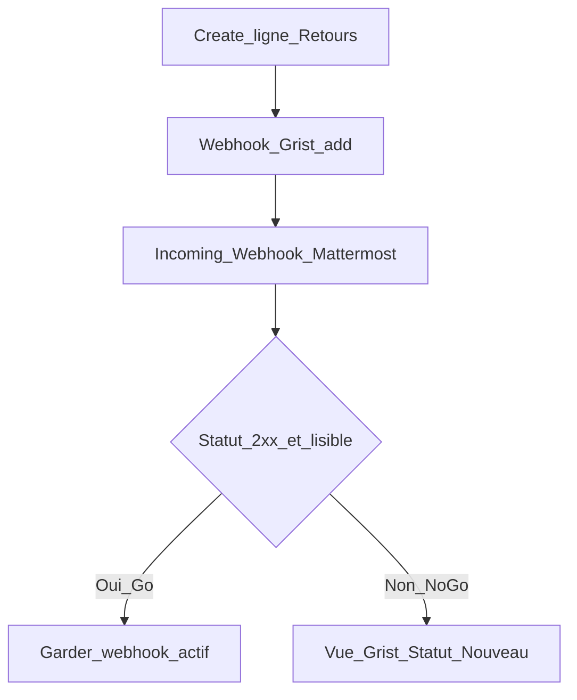

# Alertes « nouveau retour » (ops HITL)

Comment savoir qu’une ligne a été créée dans `Retours` **sans** ouvrir la table en veille — **sans e-mail Grist** et **sans ETL**.

> **Hors du widget** : aucune URL Mattermost, aucun token, aucun appel HTTP depuis le bundle Pages. Config = document Grist + Mattermost uniquement.

## Décision actuelle

| Statut | Valeur |
|--------|--------|
| **Décision** | **No-go** (smoke 2026-09-13) |
| **Preuve** | HTTP **400** Mattermost `web.incoming_webhook.decode.app_error` — Grist envoie un **tableau JSON** de lignes ; Incoming Webhook attend `{ "text": "…" }` |
| **Process actif** | **Fallback** : vue Grist `Retours` filtrée `Statut = Nouveau` |
| **Webhook Grist** | **Désactiver** + **Effacer la file d'attente** (statut `retrying` sinon) |

Sans e-mail Grist ni ETL, pas de push Mattermost fiable. Réessayer seulement si un transformateur (n8n / Worker) ou l’e-mail automation devient disponible.
---

## Contraintes

| Élément | Statut |
|---------|--------|
| Webhooks document (`Paramètres` → API → **Gérer les points d'ancrage Web**) | Disponible sur `grist.numerique.gouv.fr` |
| Automations « Send an email » | Indisponible pour l’instant |
| ETL / n8n / transformateur JSON | Pas disponible |
| Secrets dans le repo / bundle widget | Interdit |

Payload Grist = **tableau JSON** de lignes (`[{ id, Auteur, Type, Message, … }]`). Mattermost Incoming Webhook attend en général `{ "text": "…" }`. Compatibilité **non garantie** → go / no-go en quelques minutes, pas une archi figée.

---

## Étape 1 — Incoming Webhook Mattermost (HITL)

**Integrations → Webhooks entrants → Ajouter**. Valeurs recommandées :

| Champ Mattermost | Valeur |
|------------------|--------|
| **Titre** | `Retours Pilotage Grist` (≤ 64 car.) |
| **Description** | `Alertes create table Retours (widget) — webhook Grist, sans ETL` |
| **Canal** | `Studios_Pilotage_Grist` (déjà sélectionné — OK si c’est le canal cible) |
| **Verrouiller le canal** | **coché** (le webhook ne poste que dans ce canal) |
| **Nom d'utilisateur** | `retours-grist` (minuscules, ≤ 22 ; caractères `-` `_` `.` OK) |
| **Photo de profil** | laisser vide (sauf URL png/jpg ≥ 128×128 déjà hébergée) |

Puis **Enregistrer** → **copier l’URL** du webhook. Stocker hors git (notes Owner). **Ne jamais** la committer dans `pilotage_studios_grist`.

Checklist : [ ] formulaire rempli · [ ] webhook créé · [ ] URL hors repo

---

## Étape 2 — Point d’ancrage Web Grist (HITL)

Doc : **Pilotage studio (V2)** → **Paramètres** → **Gérer les points d'ancrage Web**.

| Champ | Valeur |
|-------|--------|
| **Nom** | `Retours → Mattermost` |
| **Mémo** | `add only — no ETL` |
| **Types d'événements** | **ajout** uniquement (pas les updates de tri) |
| **Table** | `Retours` |
| Filtre colonnes / Colonne de déclenchement | **vides** |
| **URL** | Incoming Webhook Mattermost (secret) |
| **Entête de sécurité** | vide sauf exigence Mattermost |
| **Activé** | oui (après ou pendant le smoke) |

Checklist : [ ] champs remplis · [ ] event = ajout · [ ] Activé

---

## Étape 3 — Smoke test (HITL)

1. Créer une ligne test dans `Retours` (UI Grist) **ou** envoyer un retour via le widget « Un retour ? ».
2. Lire le champ **Statut** du point d’ancrage Web + le canal Mattermost.
3. Si échecs en boucle → **Effacer la file d'attente**, désactiver, corriger.

### Résultat smoke (2026-09-13)

- Config webhook OK (Table `Retours`, event add, URL Mattermost Fabrique, Activé).
- Après create via formulaire widget : **Statut** = `retrying`, `lastHttpStatus` **400**, message Mattermost *Failed to decode the payload of media type application/json for incoming webhook*.
- → **No-go** (voir [Décision actuelle](#décision-actuelle)).

### Go / no-go (référence)

| Résultat | Action |
|----------|--------|
| **Go** — 2xx et message utilisable | Laisser **Activé** ; mettre à jour [Décision actuelle](#décision-actuelle) |
| **No-go** — 4xx / timeout / illisible | **Désactiver** + **Effacer la file** ; fallback ; **pas** d’ETL dans ce repo |
---

## Fallback opérationnel (process actif tant que No-go)

1. Dans Grist, page / vue **`Retours`** filtrée : `Statut` = `Nouveau`.
2. Mettre la vue en **favori** navigateur (ou lien page du doc).
3. Rituel court (standup / début de journée) : ouvrir cette vue.
4. ACL recommandées : seuls Owners / studio passent les lignes hors `Nouveau` (`À trier` → …) pour que le filtre reste un vrai file de travail — voir [README feedback](README.md#access-rules-hitl--à-appliquer-dans-grist).

Ce n’est **pas** une alerte temps réel ; c’est le minimum viable sans e-mail ni ETL.

---

## Reporté (explicite)

- Automations e-mail Grist (quand l’instance les activera).
- Relais n8n / Worker : `[{…}]` → `{ "text": "…" }` Mattermost + lien ligne.
- Boucle auteur (mail quand `Statut` = Fait / Écarté).
- Toute logique de notification **dans le widget** (bundle public).

---

## Sécurité

- URL Incoming Webhook = **secret** (équivalent jeton) — pas dans git, issues, PR, captures d’écran versionnées.
- Contenu `Message` / `Email` = donnée interne ; canal Mattermost restreint.
- Voir aussi [`SECURITY.md`](../../../SECURITY.md).
